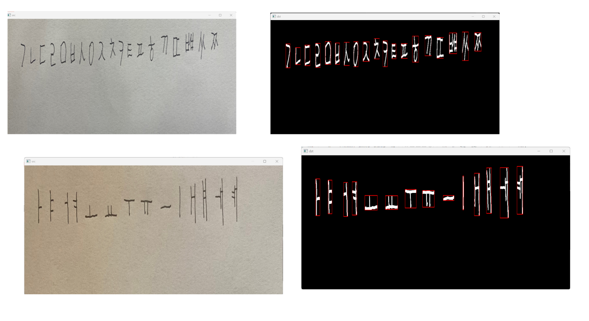
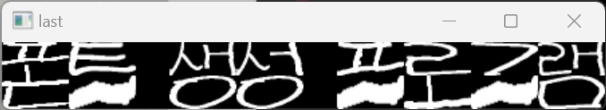

# Font_Generater_Project

   
  
   
  

목차

## 프로젝트 소개

프로젝트 개요/동기 
  - 본인의 글씨체로 자음과 모음을 적은 이미지를 업로드하면 자음 모음을 인식 및 저장.  
  - 이후 입력받은 문장을 위에서 저장한 자음 모음을 조합 후 출력.

GIF Images

 

## 기술 스택

| Python | opencv | 
| :--------: | :--------: | 
|   ![python]    |   ![opencv]    |

 

## 구현 기능

### 기능 1 - J_M_gather.py
  - erode dlite를 통해 자음 모음을 제외한 더미 부분 제거
  - 자음 모음을 순서대로 찾기 위해 시계방향으로 회전 후 진행
  - threshold()로 임계처리 후 connectedComponentsWithStat()로 자음/모음 인식
  - 순서대로 자음 모음을 각각에 맞는 파일명으로 저장
  
### 기능 2 - h_to_e.py
  - 입력받은 한글을 영타로 변환
  - zip과 dictionary를 통해 한글과 알파벳을 알맞게 매칭

### 기능 3 - yeachan_font_PJ.py
  - 초성 중성 중성의 개수 판단
  - 올바른 한글을 입력했는지 판단
  - 'ㅗㅛㅜㅠㅡ'일 경우에 초성의 아래부분에 중성이 오도록 설계
  - 중성이 두개 'ㅢ ㅟ' 등일 경우 이어붙이기
  - 종성 유무 판단 및 붙이기
  - 각 만든 단어들을 이어붙여 문장 생성
  
### 기능 4 - main.py
  - 위 3개의 파일을 import해 글씨를 저장한 파일명과 출력할 문장을 입력받아 기능 수행
  
 

## 배운 점 & 아쉬운 점

  - opencv의 imread() 함수는 sys.stdin.readline()으로 입력받은 값을 정상적으로 읽어들이지 못 함!! 
  - 함수들이 너무 중구난방이라는 느낌이 든다 다음 프로젝트는 코드를 짜기 전 좀 더 체계적으로 설계 후 개발에 들어가면 좋을듯함. 
  - 다음에는 장고와 콜라보를 통해 폰트 생성 기능이 탑재된 웹사이트를 만들어볼 계획이다. 

<!-- Stack Icon Refernces -->

[python]: /img/python.png
[opencv]: /img/opencv.png

